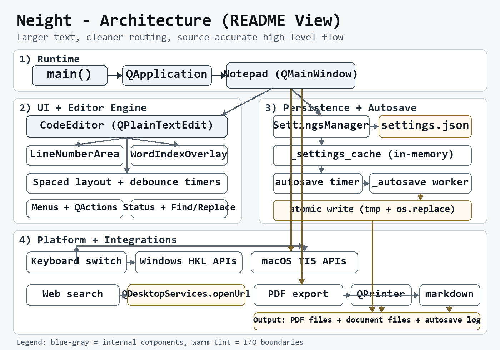

# Neight — Developer Reference

This document covers everything relevant to building, running, and understanding Neight from a developer's perspective: source setup, build scripts, architecture, performance design choices, and implementation notes.

For end-user documentation see [README.md](README.md).
For advanced user features see [ADVANCED.md](ADVANCED.md).

---

## Running from Source

```bash
git clone https://github.com/venkatarangan/neight.git
cd neight
python -m pip install --upgrade pip
pip install -r requirements.txt
python neight.py
```

### Requirements

- Python 3.10+
- PySide6 6.x (Qt 6)
- markdown
- pillow (for design helpers only)
- pyinstaller (only if building distributables)

See [requirements.txt](requirements.txt) for the current pinned list.

> Neight uses **PySide6 exclusively**. All PyQt5 references have been removed. There is no Qt5 fallback.

---

## Building Distributables

### Windows

```bat
buildme.bat
```

Or manually:

```bat
python -m pip install pyinstaller
pyinstaller --name Neight --onefile --windowed --icon neight.ico neight.py
```

Output: `dist\Neight.exe`

### macOS app bundle

```bash
chmod +x buildme_mac_app.sh
./buildme_mac_app.sh
```

This produces:

- `dist/Neight.app`
- `dist/Neight-mac-arm64-unsigned.app.zip`

### Manual macOS build

```bash
pip3 install pyinstaller
pyinstaller --name Neight --windowed --icon neight.icns neight.py
```

> Tested on Apple Silicon. An Intel build would need to be produced on appropriate hardware.

---

## Architecture

Architecture infographic (high-level):



Neight is a single-file Python application (`neight.py`) built on PySide6. There are no modules, packages, or service layers — all logic lives in one file for portability and simplicity. The main architectural elements are:

- **`NeightApplication` (QApplication subclass)** — custom app class that handles macOS `QFileOpenEvent` (Apple Events / Open With) both at startup and while running
- **`Notepad` (QMainWindow)** — main window, menus, settings lifecycle
- **`CodeEditor` (QPlainTextEdit subclass)** — the editor widget with custom key handling, drag-drop, font zoom via Ctrl+Scroll, triple-click search, and plain-text paste
- **`SpacedPlainTextDocumentLayout` (QPlainTextDocumentLayout subclass)** — custom layout engine for per-visual-line spacing
- **`WordIndexOverlay` (QWidget)** — floating overlay that numbers each word in the document
- **`FindReplaceDialog` (QDialog)** — modeless find/replace with an escape sequences helper (`\n`, `\t`, `\r`, `\xHH`, `\u0000`, etc.)
- **`LineNumberArea` (QWidget)** — gutter sidebar showing paragraph-level line numbers
- **`ClickableLabel` (QLabel)** — emits a `clicked` signal; used for the Words: status bar label
- **`SettingsManager`** — settings path resolution (primary → fallback), load/save, legacy migration, autosave log path

Dialogs such as the Language Switch settings, Appearance settings, and Reading Time settings are created inline within `Notepad` methods (`_show_keyboards_dialog`, `_show_appearance_dialog`, `_show_reading_time_dialog`). Autosave writes run on a plain `threading.Thread` (not a QThread subclass); results are marshalled back to the UI thread via Qt signals.

---

## Performance Design

Neight is optimized for typing speed. Writers working in long documents, or with non-Latin scripts like Tamil, need the editor to stay fast and out of the way.

Key optimizations:

- **Debounced status bar updates** — word, sentence, and character counts update 250 ms after you stop typing, never on every keystroke. If all counters are hidden, the O(n) full-text copy is skipped entirely.
- **Debounced word-match highlighting** — the whole-document word scan is deferred 80 ms after selection changes, with an early-exit if the selected word has not changed since the last scan.
- **Smart token reuse** — when both word count and reading time are enabled, the word tokenization pass runs only once per update cycle.
- **Auto-save on a background thread** — disk writes run entirely off the UI thread. The document text is snapshotted on the UI thread before the write begins; results are posted back via Qt signals.
- **`contentsChange` signal** — Neight uses Qt's lower-level `contentsChange` signal (which fires with change coordinates) rather than `contentsChanged` (which fires blindly for every event), so updates can be targeted rather than global.
- **Custom line spacing engine** — Qt's `QPlainTextEdit` does not support true line-height adjustments through its standard formatting API. Neight uses a custom `SpacedPlainTextDocumentLayout` subclass that overrides `blockBoundingRect()` to reposition every visual `QTextLine` within each paragraph's layout. This produces genuine per-visual-line spacing — identical in effect to Word's line spacing — so wrapped lines within a paragraph are spaced, not just paragraph breaks.

---

## Implementation Notes

### Sentence count

Sentence count is calculated from sentence-ending punctuation rather than grammar analysis. Neight splits text on common boundaries (`.`, `!`, `?`, and several Unicode equivalents), ignores empty fragments, and counts what remains. Lightweight, fast, and practical for mixed-language drafts.

### macOS Open With

Neight's macOS app bundle declares support for `.txt` and `.text` files via its `Info.plist`. This means Finder's **Open With** menu lists Neight automatically — no manual configuration required.

**How it works:**

- Right-click any `.txt` or `.text` file in Finder and choose **Open With → Neight**.
- To make Neight the default for `.txt` files, choose **Open With → Other…**, select Neight, and tick **Always Open With**.
- When Neight receives a file this way, macOS sends an Apple Event (`QFileOpenEvent`) rather than passing the path through command-line arguments. Neight handles this transparently — the file opens exactly as if you had used **File → Open** from inside the app.
- Files received via **Open With** before the main window is ready are buffered and opened as soon as the window appears, so nothing is lost even during a cold launch.

> The app bundle targets **Apple Silicon (arm64)**. Intel Mac support would require a separate build on appropriate hardware.

### Autosave watchdog and diagnostic log

If an auto-save write fails or a watchdog detects a hung write thread (e.g., on a slow or disconnected network drive), Neight appends a timestamped entry to a diagnostic log file in the same folder as `settings.json`.

The log is named with today's date: `neight_autosave_YYYY-MM-DD.log`. A new file is started each calendar day, so no single log file grows unbounded. Days with no errors produce no file at all.

### Settings validation

All numeric settings loaded from `settings.json` are validated and clamped before use. A corrupted or maliciously crafted settings file cannot cause a crash or out-of-range value being applied to the UI:

- Font size is clamped to 4–256 pt
- Auto-save interval is restricted to the allowed set `{0, 2, 5, 15, 30}` minutes
- Font family must be a string
- File size is checked before loading — files larger than **50 MB** are rejected with a clear error message

### Customizable URL prefixes

Two URL prefixes in `settings.json` can be updated without rebuilding the app:

- `google_search_url_prefix` — used by **Edit → Search with Google** (`Ctrl+E`)
- `sorkuvai_search_url_prefix` — used by the right-click **Search Sorkuvai** context menu item

Update either prefix if the service URLs change.

---

## Project Layout

```
neight.py              — the entire application
neight.ico / .icns     — app icons
requirements.txt       — Python dependencies
buildme.bat            — Windows build script
buildme_mac_app.sh     — macOS build script
Neight.spec            — PyInstaller spec (auto-generated, checked in for reference)
design/                — icon generators and architecture infographic source
knownbugs/             — documented Qt-level bugs and reproduction notes
screenshots/           — screenshots used in documentation
stable/                — signed macOS release zips
```

---

## Known Qt Issue

Tamil text navigation in Qt-based editors has a segmentation quirk for some consonant + pulli + consonant combinations. The caret or selection can jump across a whole cluster instead of stepping through individual logical letters.

This is a Qt-level behavior, not specific to Neight. Detailed notes and reproduction examples are in [knownbugs/Bug in QT for Tamil text handling.md](knownbugs/Bug%20in%20QT%20for%20Tamil%20text%20handling.md).

---

## License

MIT License. See [LICENSE](LICENSE) for details.
