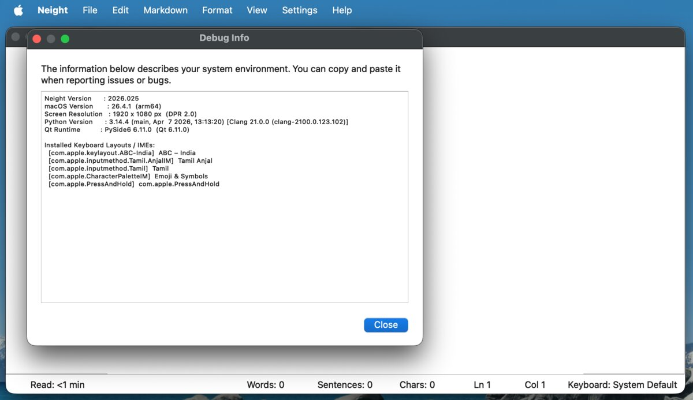
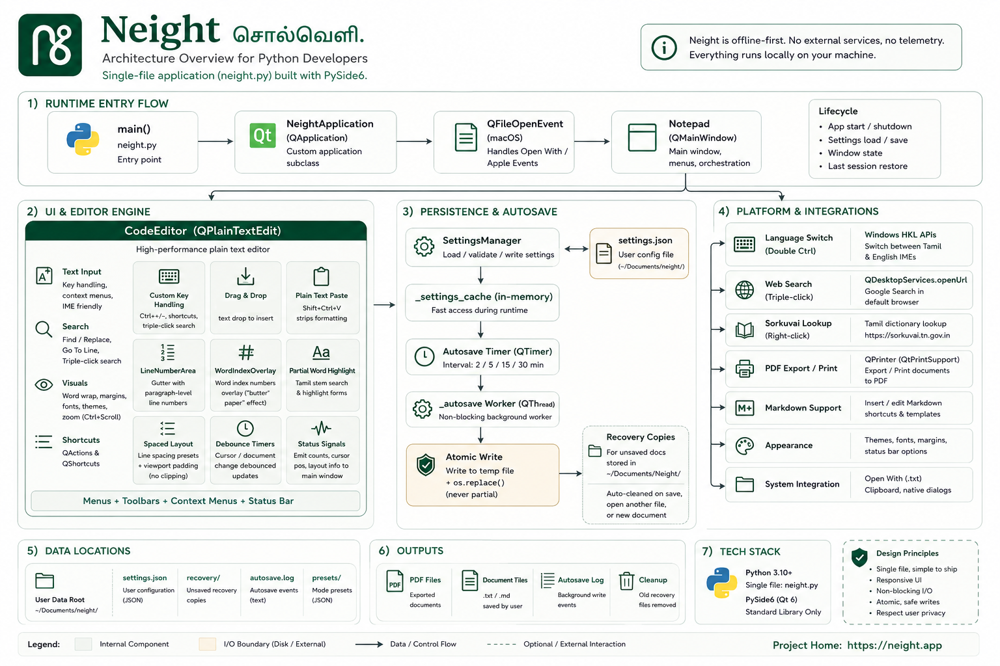

# Neight — Developer Reference

This document covers everything relevant to building, running, and understanding Neight from a developer's perspective: source setup, build scripts, architecture, performance design choices, and implementation notes.

For end-user documentation see [README.md](README.md).
For advanced user features see [ADVANCED.md](ADVANCED.md).

---

## Debug Information Panel

Neight includes a built-in debug info panel (**Help → Debug Info…**). It shows the current version, Python and Qt versions, platform details, font configuration, and key runtime settings — useful when troubleshooting an issue or filing a bug report.



---

## Running and Building from Source

Clone, create a virtual environment, install the pinned runtime dependencies,
and run.

### Windows (PowerShell)

```powershell
git clone https://github.com/venkatarangan/neight.git
cd neight
py -m venv .venv
.\.venv\Scripts\Activate.ps1
python -m pip install --upgrade pip
python -m pip install -r requirements.txt
python neight.py
```

### macOS / Linux

```bash
git clone https://github.com/venkatarangan/neight.git
cd neight
python3 -m venv .venv
source .venv/bin/activate
python -m pip install --upgrade pip
python -m pip install -r requirements.txt
python neight.py
```

To contribute changes rather than just run the app, add the development
dependencies to that same environment and activate the git hooks:

```bash
python -m pip install -r requirements-dev.txt
pre-commit install
```

> **Important:** `pre-commit install` activates the git hooks defined in `.pre-commit-config.yaml`, including the Tamil spelling guard. Run it once after every fresh clone. Without it the hook is silently inactive. See [Tamil Text Safeguards](#tamil-text-safeguards) for details.

**Building a distributable is a different environment**, deliberately narrower
than this one — see [Building Distributables](#building-distributables) for
Windows and [macOS](#macos) for the Mac.

## Requirements

- Python 3.10+ for development. **macOS release builds require a python.org
  interpreter** — currently 3.14.7 — not Homebrew's; see [macOS](#macos)
- PySide6 / shiboken6 6.11.1 (Qt 6) — pinned
- Markdown 3.10.2 — pinned
- Pygments 2.20.0 — pinned

Runtime dependencies are in [requirements.txt](requirements.txt), pinned so a
release can be reproduced. A Qt minor release can change text layout, cursor
geometry and Tamil shaping without a line of Neight changing, so bump the pin
deliberately and re-run the cross-platform checks.

Everything else is split across three files, kept apart so that no environment
carries more than it needs:

| File | Holds | Install when |
|---|---|---|
| [requirements-build.txt](requirements-build.txt) | pinned `pyinstaller` + hooks | building a distributable |
| [requirements-dev.txt](requirements-dev.txt) | the above plus `pre-commit` | ordinary development |
| [requirements-design.txt](requirements-design.txt) | `pillow` | regenerating icons from `design/` |

The split is not tidiness. PyInstaller's hooks bundle whatever they can import,
so a package installed for an unrelated reason ends up inside a shipped binary —
which is exactly what happened, and why `pillow` is no longer in
`requirements-dev.txt`.

> Neight uses **PySide6 exclusively**. All PyQt5 references have been removed. There is no Qt5 fallback.

---

## Building Distributables

### Windows build

The standard build script increments the version number automatically and then runs PyInstaller.

```bat
buildme.bat
```

For a release build, use an environment containing `requirements.txt` plus the
pinned PyInstaller version and **nothing else**. Do not build from the general
development environment: optional design and presentation packages can be
discovered by PyInstaller hooks and silently added to the executable even though
Neight never imports them. This is not theoretical: an ordinary development
`.venv` — `requirements.txt` plus `requirements-dev.txt`, nothing unusual —
produced a **68.2 MB** `Neight.exe` where the same source built clean gives
**50.4 MB**. `pillow` and `python-pptx` were the culprits (`python-pptx` also
drags in `lxml` and `xlsxwriter`). That 68.2 MB build was the public Windows
download for three weeks.

Since 2026.083 neither is in `requirements-dev.txt`: `python-pptx` is gone
entirely — the `make_slides.py` it existed for is not in this repository —
and `pillow` moved to [requirements-design.txt](requirements-design.txt),
installed only when regenerating icons. A development environment is therefore
no longer capable of producing that build. Keep it that way: the separation
above is still the rule, because the next optional package added anywhere will
behave exactly the same.

```powershell
Remove-Item -Recurse -Force .venv   # if the existing one has drifted
py -m venv .venv
.\.venv\Scripts\Activate.ps1
python -m pip install --upgrade pip
python -m pip install -r requirements.txt -r requirements-build.txt
buildme.bat
```

Reinstall `requirements-dev.txt` **after** the build to get the pre-commit hooks
back. Doing it in that order is the whole point — the development environment is
fine to have, just not while PyInstaller is looking.

#### Rebuilding without a version bump

```bat
buildme.bat --no-bump
```

Skips step 1 below and builds the version already committed in `neight.py`.

Use it when Windows is catching up to a version macOS already set. The two
platforms build on separate machines, so `VERSION` drifts between them; bumping
on a catch-up build would leave the two `dist-latest` artifacts permanently one
version apart, which is visible to anyone comparing the website's two download
links. It also leaves the working tree clean, so `build_msix.ps1` can run
straight afterwards without an intervening commit.

What it does:
1. Runs `python increment_version.py` to bump `VERSION` in `neight.py`
   (skipped with `--no-bump`)
2. Runs PyInstaller from the checked-in spec: `pyinstaller packaging\Neight.windows.spec`
3. Produces `dist\Neight.exe`
4. Publishes `dist\Neight.exe` to the `dist-latest` branch on a best-effort
   basis without changing the working tree

After a successful build the script confirms that `dist\Neight.exe` is now the
public Windows download, and points at `build_msix.ps1` for the Store package.

### macOS build

See [macOS](#macos) — the interpreter requirement, the build itself, signing,
and the App Store path are all covered there.

---

## Publishing a build

**Neight has no GitHub Releases.** Stable installs go through the app stores —
[Mac App Store](https://apps.apple.com/app/neight/id6800348235?mt=12) and
[Microsoft Store](https://apps.microsoft.com/detail/9pj70ndp41lv), both live —
and the direct downloads come from the `dist-latest` branch. The GitHub Releases that used to exist were
deleted once the stores took over, because they were a third channel nobody
used, serving binaries that no longer matched what anyone should install. The
version tags (`v2026.045` … `v2026.078`) were kept: they cost nothing and
`CHANGELOG.md` refers to those versions.

There is therefore no release script to run. `release_macos.sh`,
`release_windows.ps1` and `release_install_notes.md` were removed for the same
reason; recover them from git history if a GitHub release is ever wanted again.

### Publishing happens automatically, as the last step of a build

Both build scripts force-push the artifact they just produced to the
[`dist-latest`](#the-dist-latest-branch) branch. That branch is what the website
and `README.md` link to, so:

> **Any local build immediately becomes the public download.** There is no
> staging step and no approval between `./buildme_mac_app.sh` finishing and a
> stranger downloading it. Build deliberately.

The artifacts, and the URLs they are served from:

| Platform | Artifact | Direct link |
|---|---|---|
| Windows | `Neight.exe` | `https://raw.githubusercontent.com/venkatarangan/neight/dist-latest/dist/Neight.exe` |
| macOS | `Neight-mac-arm64-unsigned.app.zip` | `https://raw.githubusercontent.com/venkatarangan/neight/dist-latest/dist/Neight-mac-arm64-unsigned.app.zip` |

Both are **unsigned**, always the newest build, and carry no version history —
each build replaces the last. These are the links to give a developer or a
technical tester. `.github/workflows/release-assets-check.yml` checks daily that
both still resolve, since a force-pushed branch leaves no history to notice a
broken publish from.

### Commit the version bump

The build scripts bump `VERSION` in `neight.py` and leave the tree dirty by
design. Commit and push that bump, so the version a user sees in **Help > About**
corresponds to source that is actually on `main`. `build_msix.ps1` enforces
this — it refuses to package while the tree has uncommitted changes.

### Going to the stores

- **Microsoft Store:** package `dist\Neight.exe` with `build_msix.ps1` and
  submit through Partner Center. See
  [Microsoft Store (MSIX) Packaging](#microsoft-store-msix-packaging) below.
- **Mac App Store:** signing and submission happen on someone else's machine.
  See [Signing for the Mac App Store](#signing-for-the-mac-app-store).

---

## Microsoft Store (MSIX) Packaging

Neight's `.exe` triggers SmartScreen warnings for new users because it isn't
signed by a certificate with an established reputation. Publishing through
the Microsoft Store sidesteps that entirely — the Store re-signs every
package with its own certificate on publish, so an end user never sees a
SmartScreen prompt. Registration is free for an individual developer account
(Microsoft dropped the old $19 fee).

This packages the existing `Neight.exe` as a classic Win32 app under the
**Desktop Bridge** (`EntryPoint="Windows.FullTrustApplication"`), not as a
native UWP rewrite — no application source changes are needed.

### One-time account setup — already done

**This is complete and nothing here needs redoing.** The listing is live at
[apps.microsoft.com/detail/9pj70ndp41lv](https://apps.microsoft.com/detail/9pj70ndp41lv),
and `packaging/msix_identity.json` holds the real Partner Center values, so a
clean clone builds the MSIX with no setup. Kept as a record of where those
values came from, and for anyone rebuilding this from scratch:

1. Register a free individual developer account at
   [partner.microsoft.com/dashboard](https://partner.microsoft.com/dashboard).
   Identity verification can take a few days.
2. **Apps and games → + New product → reserve the name** `Neight`.
3. Open that app's **Product identity** page (under App management) and copy
   the three values shown there — **Package/Identity/Name**,
   **Package/Identity/Publisher**, **Package/Properties/PublisherDisplayName**
   — into `packaging/msix_identity.json`. Do not guess these values; they must
   match Partner Center's records byte-for-byte or the package will be rejected.

The three values are not secret — they ship inside every installed copy — which
is why they are committed rather than kept out of the repository.

### Building the package

```powershell
buildme.bat                 # produces dist\Neight.exe, as usual
build_msix.ps1              # produces dist\Neight.msix
```

Use `buildme.bat --no-bump` when repackaging a version that is already
committed — it leaves `neight.py` unmodified, so the working tree stays clean
and `build_msix.ps1` runs straight afterwards. A plain `buildme.bat` bumps
`VERSION`, which must then be committed before `build_msix.ps1` will run.

Build the `.exe` from a clean environment (above) — the MSIX packages whatever
`dist\Neight.exe` happens to be, so a development-environment build gets
published to the Store with the same bloat.

To test the package locally without submitting, enable Developer Mode and
register it in place:

```powershell
Add-AppxPackage -Register dist\msix_staging\AppxManifest.xml
```

Two things to know about that. It installs *from the build folder*, so
rebuilding changes the installed app underneath itself, and the register fails
with `0x80073D02` while any instance is running — close Neight first. And it
replaces a Store-installed copy; reinstall from the listing to get back. This
is the only way to test file associations, which do not exist until the package
is installed.

`build_msix.ps1`:

- refuses to run while `packaging/msix_identity.json` still has placeholder
  values, or while the working tree has uncommitted changes (the packaged
  version must match what's committed, so a Store submission can always be
  traced back to source on `main`);
- converts Neight's `VERSION` into the 4-part numeric version MSIX requires
  (e.g. `"2026.081"` becomes `2026.81.0.0`);
- stages `Neight.exe` plus the logo assets from
  `packaging/msix_assets/Assets/` (regenerate them from `neight.ico` any time
  with `python design/gen_msix_assets.py`) and a rendered
  `packaging/AppxManifest.xml.template` into `dist\msix_staging\`, deleting and
  recreating that directory each run — so a stray file left there by a
  locally-registered test install can never end up in a shipped package;
- parses the staged manifest before packing. `makeappx` reports any XML problem
  as the same opaque *"the package manifest is not valid"* with no line number,
  and a double hyphen inside an XML comment is enough to trigger it;
- runs `makeappx.exe pack` (from the Windows SDK — installed with Visual
  Studio, or standalone from the
  [Windows SDK downloads page](https://developer.microsoft.com/windows/downloads/windows-sdk/))
  to produce `dist\Neight.msix`.

### Testing locally before submitting

Fastest path — no signing needed, just enable **Settings → Privacy & security
→ For developers → Developer Mode** once, then:

```powershell
Add-AppxPackage -Register dist\msix_staging\AppxManifest.xml
```

To test the actual signed `.msix` file (closer to what Partner Center will
receive), run `build_msix.ps1 -Sign`. On first use this creates a throwaway
local test certificate (`packaging\NeightTestCert.pfx`/`.cer`, gitignored —
**never commit these**), signs the package with it, and prints the
`Import-Certificate` / `Add-AppxPackage` commands to trust and install it.
This certificate is for local testing only; it is never uploaded anywhere,
and has no bearing on Store submission.

### Submitting to the Store

Partner Center → your app → **Packages** → upload `dist\Neight.msix`
directly. Partner Center signs it with the Store's own certificate on
publish, so the local test certificate above is not required for submission.
Store listing content (description, screenshots, age rating) is filled in
separately in Partner Center and isn't something a script can meaningfully
automate.

---

## macOS

Building the bundle, the two channels it ships through, and the App Sandbox —
which is the only part of `neight.py` where ordinary Python file I/O is wrong.

### Building the app

Apple Silicon only: the spec sets `target_arch='arm64'` and
`buildme_mac_app.sh` refuses to run on an Intel host.

**Build with a python.org interpreter, not Homebrew's.** The interpreter sets
the bundle's macOS floor, and it is the single most consequential choice here.
The real floor is the highest `minos` among the bundled binaries: PySide6 6.11's
own bindings are built for 15.0, so nothing lower is reachable without changing
Qt, but Homebrew's Python is compiled for the macOS running it and drags the
floor up to that. Check any interpreter before trusting it:

```bash
otool -l /Library/Frameworks/Python.framework/Versions/3.14/bin/python3 \
  | awk '/LC_BUILD_VERSION/{f=1} f&&/minos/{print;exit}'
```

A python.org build reports `minos 10.15`. If it reports the current macOS
version, that is Homebrew's and the build will ship a bundle almost nobody can
run — as 2026.081 and 2026.082 did.

Build in an environment holding only the runtime dependencies and PyInstaller;
`requirements-dev.txt` has no place in it, because PyInstaller's hooks bundle
any optional package they can import:

```bash
# Name the interpreter explicitly -- `python3 -m venv` takes whatever is first
# on PATH, which on a developer Mac is usually Homebrew's.
/Library/Frameworks/Python.framework/Versions/3.14/bin/python3 -m venv .venv-build
.venv-build/bin/python -m pip install --upgrade pip
.venv-build/bin/python -m pip install -r requirements.txt -r requirements-build.txt
PYTHON_BIN="$PWD/.venv-build/bin/python" ./buildme_mac_app.sh
```

The script validates the entitlements file, bumps `VERSION`, runs PyInstaller
against `packaging/Neight.macos.spec`, measures the finished bundle and raises
`LSMinimumSystemVersion` if it claims more than it can honour, ad-hoc signs
without entitlements, and force-pushes the zip to `dist-latest`. Read the floor
line it prints — `Declared: 15.0   Actually required by the binaries: 15.0`,
with no WARNING block, is success.

> That last step is a publish. `dist-latest` is what the website and `README.md`
> link to, so **any local build immediately becomes the public macOS download**.
> Build deliberately, and commit the version bump afterwards.

### The two channels

**Direct download** — the unsigned zip on `dist-latest`, for developers and
testers. Ad-hoc signed, carrying **no entitlements**: stamping
`com.apple.security.app-sandbox` onto a build with no provisioning profile
sandboxes an app that has nothing to make the sandbox workable. If Gatekeeper
blocks it, right-click → **Open**, or `xattr -dr com.apple.quarantine
/Applications/Neight.app`.

**Mac App Store** — [`id6800348235`](https://apps.apple.com/app/neight/id6800348235?mt=12),
bundle identifier `com.murasu.neight`. Signing and submission happen on the
signer's machine, not here; this repository only produces the unsigned bundle.

> **The live Store build is behind, and broken**: it cannot open any file, and
> declares macOS 12 while its binaries need macOS 26. **2026.086** is the first
> build carrying the complete fix, and has not been submitted yet. Do not
> describe the Store build as current until a signed 2026.086 or later ships.

### Signing for the Mac App Store

[`packaging/Neight.entitlements`](packaging/Neight.entitlements) is the source
of truth; the signer passes it to `codesign --entitlements`. It declares
`app-sandbox`, `files.user-selected.read-write`, and both
`files.bookmarks.*` keys — the last two are required **even though Neight mints
no bookmark itself**, because Qt's file engine does it on the app's behalf.
Deliberately absent: any `temporary-exception.files.*` key, which would ask App
Review for standing access to the user's home directory to run a text editor.

Two traps: `entitlements_file` must stay `None` in the spec (PyInstaller applies
it regardless of `codesign_identity`, which would sandbox the direct download),
and a double hyphen inside an XML comment breaks `codesign` with only
`AMFIUnserializeXML: syntax error near line N` — hence the `plutil` and
`xmllint` checks at the top of the build script.

To hand a build over, send the zip with
[`packaging/HANDOVER-MAC-APP-STORE.md`](packaging/HANDOVER-MAC-APP-STORE.md) and
the entitlements file — all three are also on `dist-latest` — **refreshing the
artifact SHA-256 in that document first**. Confirm what a signed bundle actually
carries with `codesign -d --entitlements :- /Applications/Neight.app`.
[`packaging/MAC-APP-STORE-SIGNING.md`](packaging/MAC-APP-STORE-SIGNING.md) holds
the procedure, the signing rules, and the open items with the signer.

### The App Sandbox

The Store build runs sandboxed; the direct download does not. Four rules follow,
each easy to break by writing perfectly ordinary Python.

**1. User files go through Qt, not Python.** Qt 6.11 registers a
`SecurityScopedFileEngineHandler` in any sandboxed process: it consumes the
Powerbox grant the moment the Open or Save panel closes, keeps it as a bookmark
of its own, and redeems it only for I/O through Qt's file classes. Python's
`open()` and `pathlib` bypass file engines entirely and are denied with `EPERM`
on a file the user just picked — which is why every Store build before 2026.086
could not open a file, and why minting our own bookmarks (2026.082) could never
have helped: by the time that code ran, Qt had already taken the grant.

So `_open_file_path` and `_write_to_path` branch on `_macos_is_sandboxed()` and
route through `_sandbox_read_bytes` / `_sandbox_write_text`. Three things there
are load-bearing:

- **Pass the path exactly as the dialog returned it.** Qt keys its bookmark
  lookup on the incoming `fileName`; `Path()` normalisation misses it.
  `tests/test_sandbox_qt_io.py` pins this.
- **`QFile`, never `QSaveFile`.** `QSaveFile` writes to a temp file beside the
  target through an engine it constructs directly, bypassing the security-scoped
  one, and the panel grants the chosen *file*, not its *directory*; its
  `setDirectWriteFallback` escape hatch is guarded on `errno == EACCES` while
  sandbox denials return `EPERM`, so it never fires.
- **The sandboxed save is not atomic**, and cannot be — the sandbox forbids
  write-temp-then-rename. `_atomic_write_text` is untouched everywhere else. Do
  not reintroduce a temp file here; it is denied, not slow.

**2. `Path.home()` is the container, not the user's home.** `HOME` is redirected
to `~/Library/Containers/com.murasu.neight/Data/`, so `~/Documents/Neight/` is a
folder no user can find and macOS deletes with the app. `_get_app_data_dir()`
returns Application Support when sandboxed; `_default_start_directory()` finds
the real Documents through `pwd.getpwuid(os.getuid())`, since the passwd
database is not redirected, and a container path is never persisted to settings.

**3. Detect with the OS, not the environment.** `_macos_is_sandboxed()` calls
`sandbox_check(getpid(), NULL, 0)`. `APP_SANDBOX_CONTAINER_ID` is set under a
Terminal launch but absent under LaunchServices — every Store user's
double-click — so keying off it disables this layer for exactly the people it
exists for.

**4. Two operations are forbidden and one fails silently**, all three already
handled: exec'ing a binary outside the bundle (revealing a folder uses
`QDesktopServices`), writing the Launch Services handler database (the "default
handler" button is disabled in the Store build, though reading the current
handler still works), and `QPrinter`, which reports nothing when a write is
denied — `_verify_pdf_written` checks the file before either PDF exporter claims
success.

Nobody working on this repository can sign a sandboxed build, so the code
narrates itself: launch with `NEIGHT_SANDBOX_DIAG=1` and every stage of the file
paths logs to `sandbox-diagnostics.log` in the container's Application Support
folder, with Qt's own `errorString()`. Unset, nothing is written or read.

### Open With

`packaging/Neight.macos.spec` declares `CFBundleDocumentTypes` for plain text
and Markdown, which is what puts Neight in Finder's **Open With** menu. macOS
delivers the file as an Apple Event (`QFileOpenEvent`), not in `argv`;
`NeightApplication` handles it at startup and while running, buffering files
that arrive before the window exists.

---

## Why `dist/` Isn't on GitHub

`dist/` is gitignored on `main`, and has been since 2026-07-27. It didn't
start that way: `dist/` and a since-removed `stable/` used to be committed
directly, which
meant 127 MB of binaries — 2.68 GB once every past build was counted across
history — so a plain `git clone` pulled down every `.app` and `.exe` ever
built, and every commit that shipped a build was an opaque binary diff. History
was rewritten with `git-filter-repo` to strip both directories from every
commit. At the time nothing was lost, because every binary had also been
published to GitHub Releases — see `knownbugs/MACOS-VALIDATION-RESULTS.md`
(decision C4) for the full account, including the safety branch kept in case
anything turned out to be missing.

> Those Releases have since been **deleted**, so that fallback copy of the old
> binaries no longer exists. The version tags remain, and they point at the
> source each build came from, which is the part worth keeping. Nothing in the
> project depends on the old binaries; noted so nobody goes looking for them.

The practical effect: cloning `main` today gets you a source checkout only, and
binaries live in exactly one place —

- **The `dist-latest` branch**, which serves both the external signing workflow
  *and* the direct-download links on the website, `README.md` and
  `ADVANCED.md`. Described next.

### The `dist-latest` branch

An external code-signing workflow (outside this repo) needs to fetch the
freshly built, *unsigned* Mac and Windows artifacts before they're signed and
released. It does that over a plain `raw.githubusercontent.com` URL — which,
unlike a Release asset, only ever serves a file that is actually committed to
some branch. `dist/` being gitignored on `main` breaks that fetch, and
committing binaries back onto `main` to fix it would undo the entire point of
the rewrite above.

`dist-latest` is a separate branch, unrelated to `main`'s history, that exists
solely to hold the *current* Mac and Windows build artifacts, at these fixed
URLs:

```
https://raw.githubusercontent.com/venkatarangan/neight/dist-latest/dist/Neight-mac-arm64-unsigned.app.zip
https://raw.githubusercontent.com/venkatarangan/neight/dist-latest/dist/Neight.exe
```

Both `buildme_mac_app.sh` and `buildme.bat` publish to it automatically, as
the last step of every successful build — nothing to run separately. Each
publish **amends** the branch's one existing commit and force-pushes, rather
than adding a new commit on top, so the branch is always exactly one commit
holding only the current binaries. Without that, it would slowly turn into
the same kind of binary graveyard `main` used to be, just one branch over. The
macOS and Windows steps each touch only their own file, so either script can
run independently — on its own machine, at its own time — without clobbering
whatever the other has already published. Both run inside a throwaway
temporary clone, so the real working tree (checked out on `main`) is never
touched, and a publish failure — no network, no `origin` remote — is reported
but does not fail the build; the app is already built (and, on macOS, signed)
by that point regardless.

There is nothing to merge or review on this branch. It's a side channel for
one external consumer, not something that ever becomes part of `main`.

---

## Architecture

Architecture overview for Python developers — covers all seven areas: runtime entry flow, UI & editor engine, persistence & autosave, platform integrations, data locations, outputs, and tech stack. Internal components are shown in white, I/O boundaries in amber, and data/control flow as solid arrows.



Neight is a single-file Python application (`neight.py`) built on PySide6. There are no modules, packages, or service layers — all logic lives in one file for portability and simplicity. The main architectural elements are:

- **`NeightApplication` (QApplication subclass)** — custom app class that handles macOS `QFileOpenEvent` (Apple Events / Open With) both at startup and while running
- **`Notepad` (QMainWindow)** — main window, menus, settings lifecycle
- **`CodeEditor` (QPlainTextEdit subclass)** — the editor widget with custom key handling, drag-drop, font zoom via Ctrl+Scroll, triple-click search, and plain-text paste
- **`SpacedPlainTextDocumentLayout` (QPlainTextDocumentLayout subclass)** — custom layout engine for per-visual-line spacing
- **`WordIndexOverlay` (QWidget)** — floating overlay that numbers each word in the document
- **`FindReplaceDialog` (QDialog)** — modeless find/replace with an escape sequences helper (`\n`, `\t`, `\r`, `\xHH`, `\u0000`, etc.)
- **`LineNumberArea` (QWidget)** — gutter sidebar showing paragraph-level line numbers
- **`ClickableLabel` (QLabel)** — emits a `clicked` signal; used for the Words: status bar label
- **`SettingsManager`** — settings path resolution (primary → fallback), load/save, legacy migration, autosave log path
- **The macOS sandbox I/O layer** (module-level functions, not a class) — `_macos_is_sandboxed()`, `_sandbox_read_bytes()`, `_sandbox_write_text()`, `_get_app_data_dir()` and `_default_start_directory()`. Inside the Mac App Store sandbox, user-file I/O must go through Qt rather than Python, and app-private state must not go to `~/Documents`. Every one of these is a no-op outside the sandbox. See [The App Sandbox](#the-app-sandbox) — it is the least obvious part of the file.

Dialogs such as the Language Switch settings, Appearance settings, and Reading Time settings are created inline within `Notepad` methods (`_show_keyboards_dialog`, `_show_appearance_dialog`, `_show_reading_time_dialog`). Autosave writes run on a plain `threading.Thread` (not a QThread subclass); results are marshalled back to the UI thread via Qt signals.

**Data locations are conditional on macOS.** `settings.json` and the autosave log always sit in `~/Library/Application Support/Neight/` there. Presets and recovery copies go to `~/Documents/Neight/` in the direct download, but to Application Support in the sandboxed Store build from 2026.086 — `~/Documents` inside a sandbox is the container's, not the user's. The architecture diagram above shows the unsandboxed layout; treat its data-location boxes as the direct-download case.

---

## Performance Design

Neight is optimized for typing speed. Writers working in long documents, or with non-Latin scripts like Tamil, need the editor to stay fast and out of the way.

Key optimizations:

- **Debounced status bar updates** — word, sentence, and character counts update 250 ms after you stop typing, never on every keystroke. If all counters are hidden, the O(n) full-text copy is skipped entirely.
- **Debounced word-match highlighting** — the whole-document word scan is deferred 80 ms after selection changes, with an early-exit if the selected word has not changed since the last scan.
- **Smart token reuse** — when both word count and reading time are enabled, the word tokenization pass runs only once per update cycle.
- **Auto-save on a background thread** — disk writes run entirely off the UI thread. The document text is snapshotted on the UI thread before the write begins; results are posted back via Qt signals.
- **`contentsChange` signal** — Neight uses Qt's lower-level `contentsChange` signal (which fires with change coordinates) rather than `contentsChanged` (which fires blindly for every event), so updates can be targeted rather than global.
- **Custom line spacing engine** — Qt's `QPlainTextEdit` does not support true line-height adjustments through its standard formatting API. Neight uses a custom `SpacedPlainTextDocumentLayout` subclass that overrides `blockBoundingRect()` to reposition every visual `QTextLine` within each paragraph's layout. This produces genuine per-visual-line spacing — identical in effect to Word's line spacing — so wrapped lines within a paragraph are spaced, not just paragraph breaks.

---

## Implementation Notes

### Sentence count

Sentence count is calculated from sentence-ending punctuation rather than grammar analysis. Neight splits text on common boundaries (`.`, `!`, `?`, and several Unicode equivalents), ignores empty fragments, and counts what remains. Lightweight, fast, and practical for mixed-language drafts.

### Autosave watchdog and diagnostic log

If an auto-save write fails or a watchdog detects a hung write thread (e.g., on a slow or disconnected network drive), Neight appends a timestamped entry to a diagnostic log file in the same folder as `settings.json`.

The log is named with today's date: `neight_autosave_YYYY-MM-DD.log`. A new file is started each calendar day, so no single log file grows unbounded. Days with no errors produce no file at all.

### Settings validation

All numeric settings loaded from `settings.json` are validated and clamped before use. A corrupted or maliciously crafted settings file cannot cause a crash or out-of-range value being applied to the UI:

- Font size is clamped to 4–256 pt
- Auto-save interval is restricted to the allowed set `{0, 2, 5, 15, 30}` minutes
- Font family must be a string
- File size is checked before loading — files larger than **50 MB** are rejected with a clear error message

### Customizable URL prefixes

Two URL prefixes in `settings.json` can be updated without rebuilding the app:

- `google_search_url_prefix` — used by **Edit → Search with Google** (`Ctrl+E`)
- `sorkuvai_search_url_prefix` — used by the right-click **Search Sorkuvai** context menu item

Update either prefix if the service URLs change.

---

## Project Layout

```
neight.py              — the entire application
neight.ico / .icns     — app icons
requirements.txt       — pinned runtime dependencies
requirements-build.txt — minimal pinned distributable build tooling
requirements-dev.txt   — build tooling plus pre-commit, for development
requirements-design.txt — pillow, for the design/ scripts only (kept out of
                         the development environment on purpose)
buildme.bat            — Windows build script
buildme_mac_app.sh     — macOS build script
build_msix.ps1         — packages dist\Neight.exe as a Microsoft Store MSIX
                         (see "Microsoft Store (MSIX) Packaging" above)
packaging/             — the PyInstaller specs the build scripts use:
                         Neight.windows.spec (EXE) and Neight.macos.spec (BUNDLE).
                         These are build inputs, not generated output — do not
                         build with a bare `pyinstaller ... neight.py`, which
                         overwrites a spec instead of using one.
                         Also: Neight.entitlements (the Mac App Store sandbox
                         entitlements, applied by the signer, not by this repo's
                         build), MAC-APP-STORE-SIGNING.md and
                         HANDOVER-MAC-APP-STORE.md (sent to the signer with a
                         build), SIGNER-DIAGNOSTIC-RUN.md with its answered
                         SIGNER-DIAGNOSTIC-2026.084-RESULTS.md and the redacted
                         sandbox-diagnostics-2026.084.txt — the run that found
                         the sandbox root cause; plus
                         AppxManifest.xml.template, msix_identity.json
                         and msix_assets/ for the MSIX package above.
design/                — icon generators, MSIX asset generator, and
                         architecture infographic source
knownbugs/             — documented Qt-level bugs, validation runs and fix records
session-notes/         — per-session handoff records (see "Session notes" above)
tests/                 — regression suite, run in CI on Windows and macOS
screenshots/           — screenshots used in documentation
dist/                  — build output (gitignored — see "Why dist/ Isn't on GitHub")
CHANGELOG.md           — what changed in each build, tagged by platform
```

Also on GitHub: a `dist-latest` branch, unrelated to `main`'s history, that
exists only to hold the current unsigned Mac and Windows build artifacts for
an external code-signing workflow. See "Why `dist/` Isn't on GitHub" above.

### Session notes

[`session-notes/`](session-notes/) holds a handoff record per working
session — what changed, why, what was verified and how, and what was left open.
Written for a person or an AI assistant starting cold on another machine. Start
with the newest one; **if you are picking this repository up on Windows for the
first time in a while, read its opening section before running `git pull`** —
the July 2026 history rewrite means an old clone cannot fast-forward.

### Regression suite

Plain scripts rather than pytest, so CI needs nothing beyond `requirements.txt`.
Run them before pushing — CI runs exactly these:

```bash
QT_QPA_PLATFORM=offscreen python3 tests/test_startup_settings.py
QT_QPA_PLATFORM=offscreen python3 tests/test_text_integrity.py
QT_QPA_PLATFORM=offscreen python3 tests/test_cursor_layout.py
QT_QPA_PLATFORM=offscreen python3 tests/test_input_gestures.py
QT_QPA_PLATFORM=offscreen python3 tests/test_selection_counts.py
QT_QPA_PLATFORM=offscreen python3 tests/test_unsaved_prompt.py
QT_QPA_PLATFORM=offscreen python3 tests/test_sandbox_qt_io.py
```

Each exits non-zero on failure and prints failures as GitHub Actions
annotations. See [tests/README.md](tests/README.md) for what each one guards and
why.

---

## Known Qt Issue

Tamil text navigation in Qt-based editors has a segmentation quirk for some consonant + pulli + consonant combinations. The caret or selection can jump across a whole cluster instead of stepping through individual logical letters.

This is a Qt-level behavior, not specific to Neight. Detailed notes and reproduction examples are in [knownbugs/Bug in QT for Tamil text handling.md](knownbugs/Bug%20in%20QT%20for%20Tamil%20text%20handling.md).

---

## Tamil Text Safeguards

### The problem: LLM tokenization corruption of Tamil vowels

Tamil text in this project is vulnerable to silent corruption by LLMs (including Claude Sonnet 4.6 and GitHub Copilot). These models have a known tokenization bias with Indic scripts that causes them to silently substitute visually similar but phonetically distinct vowel marks. Specifically, they replace the short 'o' vowel ொ with the long 'ō' vowel ோ, producing a word that does not exist in Tamil. We caught this class of bug in output generated by the app itself.

The corrupted form is never correct. It is not a spelling variant — it is a non-word. No developer, tool, or automated system should ever write or commit it.

### Safeguards in place

Three layers of protection have been added to this project:

1. **Pre-commit hook** (`.pre-commit-config.yaml`) — a `pygrep`-based hook scans `.py` and `.html` files for the corrupted form before every commit and aborts with an error if it is found. It also enforces UTF-8 encoding and LF line endings.

2. **GitHub Actions workflow** (`.github/workflows/tamil-guard.yml`) — runs on every push and pull request. Uses `grep -P` (PCRE) to check all `.py` and `.html` files. If the corrupted form is found, the build fails with an explicit error message.

3. **Copilot repository instructions** (`.github/copilot-instructions.md`) —
   tell AI coding tools not to retype, autocomplete, or modify Tamil strings,
   preventing corruption before either automated guard needs to catch it.

### Setup after cloning

After installing the development dependencies as described under
[Running and Building from Source](#running-and-building-from-source), activate the hook:

```bash
pre-commit install
```

This is required for the hook to run on `git commit`. Without it, the hook is inactive and the local safeguard is silently bypassed.

**Never disable or bypass the pre-commit hook** (`--no-verify`). The hook exists specifically because the corruption is invisible in most editors — it looks correct on screen but is wrong at the byte level.

### Editor encoding requirements

All source files must be saved as **UTF-8 without BOM**. The pre-commit hook enforces this via `check-byte-order-marker`, but the editor must also be configured correctly:

- The tracked `.editorconfig` sets UTF-8 and LF for the repository.
- In VS Code, set `"files.encoding": "utf8"` and
  `"files.autoGuessEncoding": false` in your user or workspace settings.
- In other editors, ensure UTF-8 without BOM is the default encoding for the
  workspace.

Saving a file in a different encoding (UTF-16, Latin-1, etc.) will corrupt Tamil characters silently and the pre-commit hook will catch it on the next commit.

---

## License

MIT License. See [LICENSE](LICENSE) for details.
