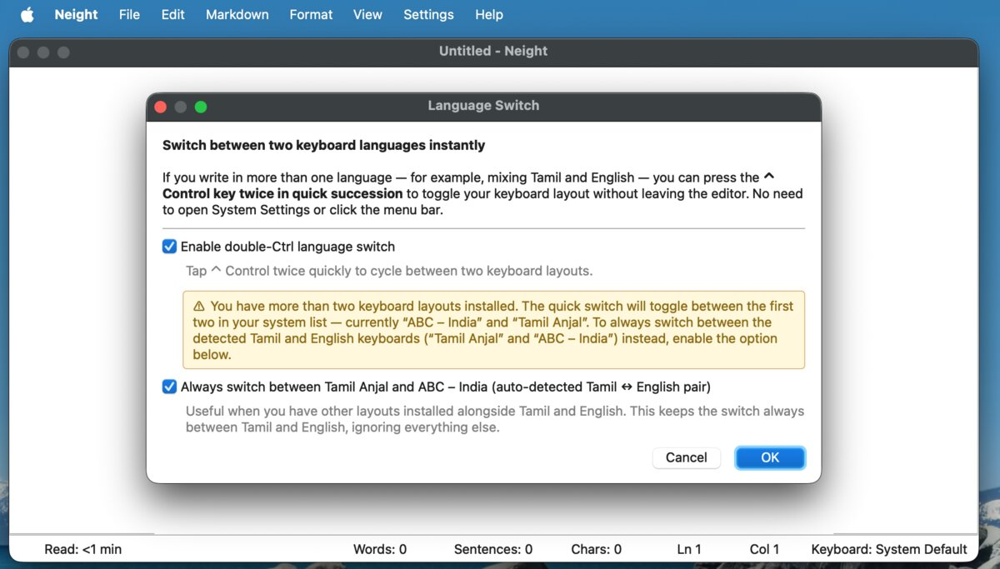

# Neight — Notepad Enhanced, Tamil-Friendly

**Current Version: 2026.045** | [Privacy Policy](PRIVACY.md)

**Neight** (pronounced N8) is a lightweight text editor for writers who work in Tamil and English on Windows and macOS. It handles mixed-language drafting, Markdown, and distraction-free writing without the weight of a full IDE or word processor.


**Neight does not use any AI models, call any external services, or send telemetry.** Everything runs locally on your machine.

---

## Quick Start

### Download

- **Windows:** [Download Neight.exe](https://github.com/venkatarangan/neight/blob/main/dist/Neight.exe) (~51 MB)
- **macOS Apple Silicon (arm64):** [Download signed Neight.app zip](https://github.com/venkatarangan/neight/blob/main/stable/Neight-mac-arm64-signed.zip) (~40 MB, recommended)
- **macOS unsigned build:** [Download from dist](https://github.com/venkatarangan/neight/blob/main/dist/Neight-mac-arm64-unsigned.app.zip) (~40 MB)

### Install on Windows

1. Download `Neight.exe` and copy it to any folder.
2. Double-click to run. If Windows Defender SmartScreen appears, click **More info → Run anyway**.

### Install on macOS

1. Download and unzip the signed zip.
2. Drag `Neight.app` to `/Applications` and launch it normally.

If macOS blocks the app, run this once in Terminal:

```bash
xattr -dr com.apple.quarantine /Applications/Neight.app
```

> The signed macOS build carries an Apple Developer signature contributed by a well-wisher to make installation smoother. The macOS build targets **Apple Silicon (arm64)** only.

---

## Screenshots

Language Switch settings:



Debug information panel:


Additional screenshots are in the [screenshots](screenshots) folder.

---

## What Neight Does

### The basics you expect from any editor

- New, Open, Save, Save As — standard shortcuts (`Ctrl+S`, `Ctrl+F`, `Ctrl+G`, `F5`, …)
- Undo/Redo, Find/Replace, Go To Line, Time/Date insert
- Word wrap, custom fonts, dark mode, zoom
- Opens and saves both `.txt` and `.md` files
- **Find/Replace escape sequences** — click the ℹ button inside the Find/Replace bar to insert special characters like `\n` (newline), `\t` (tab), `\xHH` (hex byte), `\u0000` (Unicode codepoint) into search fields
- **Triple-click** a word to instantly search for it in Google (the word is selected and your default browser opens)
- **Zoom font size** with `Ctrl++` / `Ctrl+-` or `Ctrl+Scroll wheel`

### Tamil and bilingual writing

- **Double-press Ctrl** (or **⌃ Control** on macOS) to switch keyboard layouts instantly without leaving the editor — between Tamil and English, or any two installed layouts
- **Sorkuvai lookup** — right-click a Tamil word to look it up in the Tamil dictionary
- **Partial word highlighting** — select a Tamil stem and see all inflected forms highlighted across the document
- **Normalize Unicode (NFC)** — clean up inconsistent codepoint sequences from mixed input methods before publishing

### Writing workflow improvements

- **Gutter line numbers** (`Ctrl+Shift+L`) — paragraph-level line numbers like a code editor
- **Adjustable margins and line spacing** — five spacing presets (Condensed through Triple); viewport padding is added automatically so lines never clip at the window edge
- **Auto-save** at configurable intervals (2, 5, 15, or 30 minutes) — writes are atomic, run on a background thread, and never cause a visible pause
- **Continue where you left off** — reopens your last file at startup (toggleable under Settings)
- **Automatic update check** — on every launch Neight silently checks GitHub for a newer version in the background. If one is found, a small **●** badge appears on the **Help** menu and a brief status bar message is shown — no pop-up, no interruption. Use **Help → Check for Updates…** at any time to check manually.
- **Auto-Hide Scrollbar** — scrollbar flashes briefly when you scroll, then disappears to keep the writing area clean
- **Plain-text paste** (`Shift+Ctrl+V`) — strips formatting on paste
- **New Window** — open a second instance for side-by-side writing
- **Open With integration** — Neight appears in Finder's / Explorer's right-click **Open With** menu for `.txt` files

### Status bar

The status bar shows — per your preferences — word count, sentence count, character count, reading time, cursor line/column, and current keyboard layout. Every element can be individually shown or hidden from **View → Status Bar** (or click the status bar itself to open that submenu instantly). Layout is fixed-width so hiding one item never shifts the others.

### Markdown support

All Markdown shortcuts live in the **Markdown** menu:

- Headings `Ctrl+1`–`Ctrl+6`, bold, italic, bold italic
- Lists (unordered, ordered, checkbox), quotes, code blocks, strikethrough, highlight
- Table templates, horizontal rules
- Hyperlink and image insertion with URL validation
- Smart tag replacement — changing a heading level or style removes old markers before inserting new ones

> **Privacy note:** URL validation makes a single HEAD request only when you explicitly click **Validate URL** — Neight makes no network calls on its own.

### PDF export

Export plain text or Markdown to PDF from **File**:

- A4 layout with proper margins; filename header (text) or rendered headings and tables (Markdown)
- Font choice is carried into the PDF
- Context-sensitive: the menu shows Text-to-PDF or Markdown-to-PDF based on the open file type

### Blank-line tools

Two small draft-cleanup tools under **Edit**:

- **Insert Blank Lines** — adds a blank line after every non-empty line (useful for review or annotation)
- **Collapse Blank Lines** — reduces runs of blank lines to one (useful for normalizing pasted content)

### One-click writing modes

- **Help → Writer (சொல்வெளி) Mode** — large Tamil serif font, generous spacing and margins, minimal status bar. Great for distraction-free prose.
- **Help → Techie (நுட்பர்) Mode** — compact font, full status bar, gutter line numbers. Great for technical writing.

See [ADVANCED.md](ADVANCED.md) for the full settings applied by each mode, and for the **Save Preset** feature that lets you customize these modes.

---

## Menu Overview

| Menu | What you find there |
|---|---|
| **File** | New, New Window, Open, Save, Save As, Export Text to PDF, Export Markdown to PDF, Exit |
| **Edit** | Undo/Redo, clipboard, Find, Find Next, Replace, Replace All, Go To, Time/Date, Search with Google, Select All, blank-line tools, Normalize Unicode |
| **Markdown** | All Markdown insertion shortcuts — headings, lists, formatting, links, tables |
| **Format** | Font, Word Wrap |
| **View** | Line Spacing, Margins, Gutter Line Numbers, Word Index, Auto-Hide Scrollbar, Partial Word Highlighting, Status Bar controls |
| **Settings** | Auto-save, Continue where you left off, Appearance, Language Switch, Save current settings to (Writer Mode Preset / Techie Mode Preset) |
| **Help** | Writer (சொல்வெளி) Mode, Techie (நுட்பர்) Mode, Check for Updates, About, Debug Info |

---

## Keyboard Shortcuts

| Action | Shortcut |
|---|---|
| New File | Ctrl+N |
| New Window | Ctrl+Shift+N (Win/Linux), Meta+Shift+N (macOS) |
| Open | Ctrl+O |
| Save | Ctrl+S |
| Save As | Ctrl+Shift+S |
| Find / Replace | Ctrl+F / Ctrl+H |
| Find Next | F3 |
| Go To Line | Ctrl+G |
| Insert Date/Time | F5 |
| Search with Google | Ctrl+E |
| Plain-text Paste | Shift+Ctrl+V or Shift+Insert |
| Increase / Decrease font size | Ctrl++ / Ctrl+- |
| Zoom font with mouse | Ctrl+Scroll wheel |
| Gutter Line Numbers | Ctrl+Shift+L |
| Word Index | Ctrl+Shift+W |
| Language Switch | Double Ctrl (Win/Linux) or Double ⌃ Control (macOS) |
| Switch to layout 1 / 2 | Ctrl+, / Ctrl+. |
| Markdown menu | Alt+M |
| Heading 1–6 | Ctrl+1 to Ctrl+6 |
| Bold / Italic / Bold Italic | Ctrl+B / Ctrl+I / Ctrl+Shift+B |
| Code Block | Ctrl+Shift+K |
| Hyperlink | Ctrl+K |

---

## Advanced Features

[ADVANCED.md](ADVANCED.md) covers the features aimed at power users who want to go beyond the defaults:

- **Writer (சொல்வெளி) Mode** and **Techie (நுட்பர்) Mode** — full settings tables
- **Save Presets** — save your own settings as the baseline for a mode, stored in `~/Documents/neight/`
- **Reading Time** — configurable Tamil and English reading speeds with per-script calculation
- **Word Index Overlay** — number every word in your document; fully customizable appearance
- **Language Switch configuration** — choose which two layouts to switch between
- **Appearance settings** — theme options, custom colors, overlay opacity and color controls
- **Unicode tools** — NFC normalization and partial word highlighting details
- **Settings and file locations** — where `settings.json` lives, how to reset, autosave logs
- **Known Tamil text navigation issue** in Qt

---

## Why Neight Exists

I started Neight after running into Tamil text rendering and editing issues in the newer Windows Notepad. Other editors were either too heavy, too cluttered, or simply not suited to quick bilingual writing.

The goal was simple: make a small, dependable editor that feels close to Notepad, but works better for the way I actually write.

Neight is especially useful if you want:

- a simple editor for short and medium-form writing
- better support for Tamil + English workflows
- a lightweight app instead of a full IDE or word processor
- a Markdown-capable editor without a cluttered toolbar

---

## Acknowledgements


The idea for Neight was sparked by Pa. Raghavan, editor of [MadrasPaper.com](https://madraspaper.com) — an online Tamil magazine. His years-long search for the perfect distraction-free writing app on macOS was the seed that became this project. That level of care for the craft of writing was reason enough to build something.

Warm thanks also to Muthu Nedumaran of [Murasu.com](https://murasu.com) for his encouragement and support throughout.

Neight is a personal project, vibe-coded with AI assistance and brewed at [venkatarangan.com](https://venkatarangan.com). The name: **NotepadEnhanced → NotepadE → N8 → Neight**.

---

## Future Ideas

- Markdown live preview pane
- Export to DOCX
- A proper Windows installer
- Page numbers in PDF footer
- Print preview before PDF export
- Optional AI features for translation, rewriting, or lookup
- ~~Integrate Tamil dictionary (like Tamil Nadu Government's Sorkuvai)~~

---

## For Developers

[DEVELOPER.md](DEVELOPER.md) covers everything you need to build, run, or understand Neight's internals:

- Running from source and requirements
- Building distributables on Windows and macOS
- Architecture overview and project layout
- Performance design choices
- macOS Open With implementation
- Autosave watchdog and diagnostic logs
- Settings validation and security notes

---

## License

This project is licensed under the **MIT License**. See [LICENSE](LICENSE) for details.

---

## Disclaimer

Neight is provided **AS IS**, without warranties of any kind, express or implied, including fitness for a particular purpose, reliability, availability, performance, and accuracy.

Neight is not affiliated with, endorsed by, or sponsored by Google, Sorkuvai, the Government of Tamil Nadu, or any other third-party service or brand referenced by this project. Neight only opens those public services by passing user-selected query text through configured URL prefixes. All third-party names, trademarks, service marks, logos, and copyrights remain the property of their respective owners.

You are responsible for validating whether it is suitable for your own workflow.

