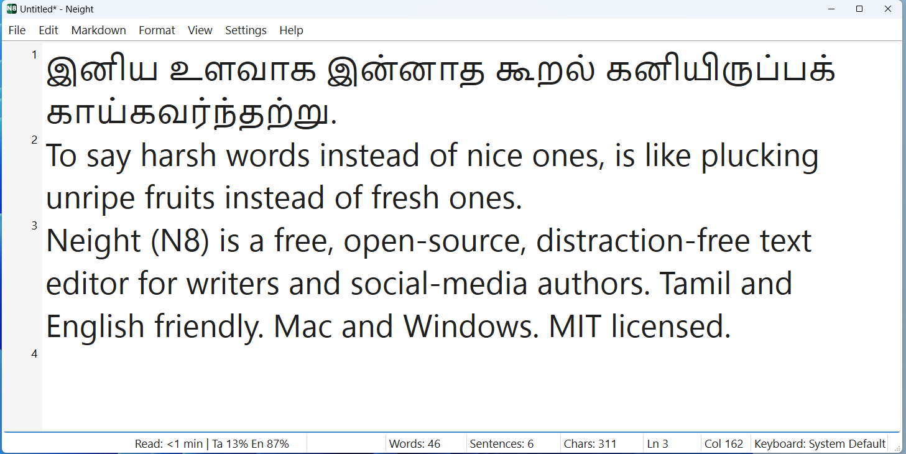
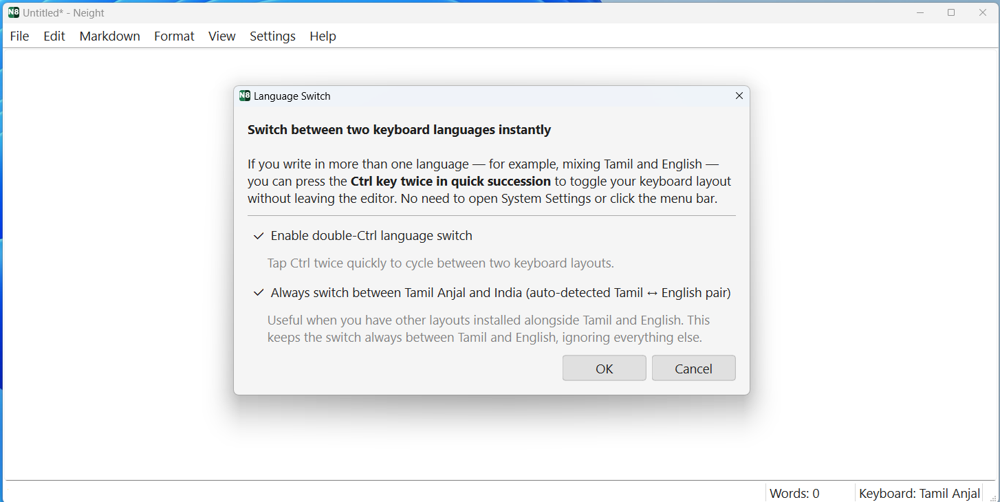
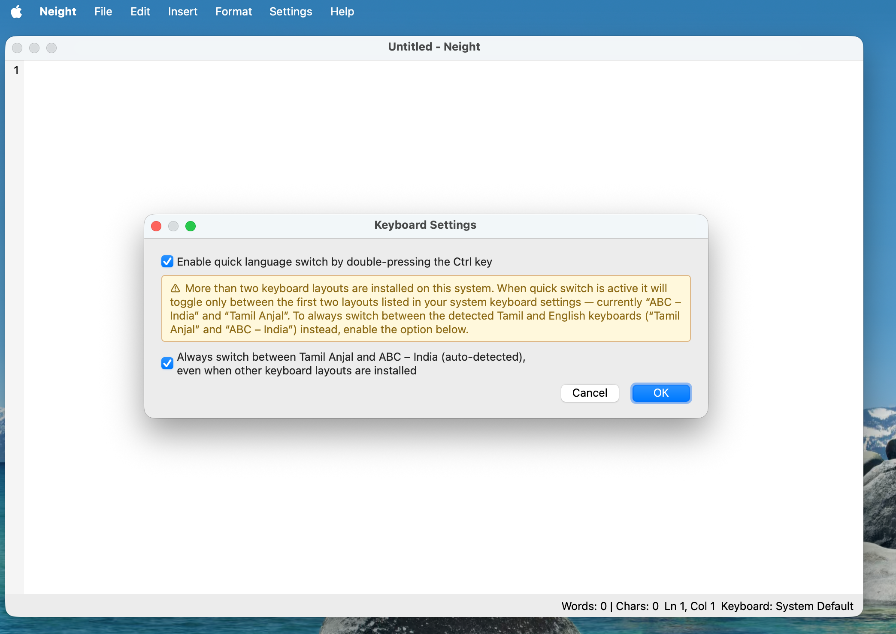
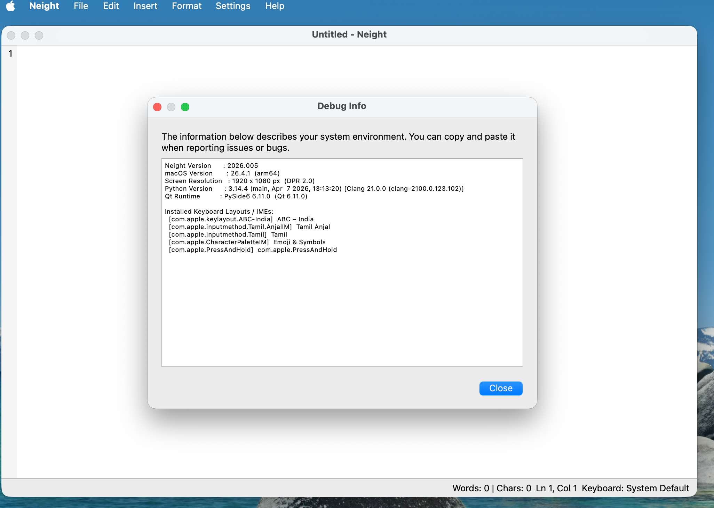

# Neight - Notepad Enhanced, Tamil-Friendly

**Current Version: 2026.019** | [Version History](changes/VERSION_SUMMARY.md) | [Privacy Policy](PRIVACY.md)

**Neight** is a lightweight text editor for Windows and macOS, inspired by classic Notepad and shaped around real writing use: Tamil, English, mixed-language drafting, quick notes, Markdown, and distraction-free editing.

It started as a tool for my own daily workflow and continues to evolve as a practical AI-assisted software project.

---

## Quick Start

### Download a pre-built app

- **Windows:** [Download Neight.exe](https://github.com/venkatarangan/neight/blob/main/dist/Neight.exe) (~51 MB)
- **macOS Apple Silicon (arm64):** [Download signed Neight.app zip](https://github.com/venkatarangan/neight/blob/main/stable/Neight-mac-arm64-signed.zip) (~40 MB, recommended)
- **Latest unsigned macOS development build:** [Download from dist](https://github.com/venkatarangan/neight/blob/main/dist/Neight-mac-arm64-unsigned.app.zip) (~40 MB)

### Install on Windows

1. Download `Neight.exe`.
2. Copy it to a folder of your choice.
3. Optionally pin it to Start or the taskbar.
4. Double-click to run.

If Windows Defender SmartScreen appears, click **More info** and then **Run anyway**.

### Install on macOS

1. Download the signed zip.
2. Unzip it in Finder.
3. Drag `Neight.app` to `/Applications`.
4. Launch it normally.

If macOS still blocks the app for any reason, run this once in Terminal:

```bash
xattr -dr com.apple.quarantine /Applications/Neight.app
```

> The signed macOS build is provided as-is. It is the same open-source app, with a proper Apple Developer signature contributed by a well-wisher to make installation smoother.

> The macOS build currently targets **Apple Silicon (arm64)** only.

---

## Screenshots

Main editor:



Keyboard settings on Windows:



Keyboard settings on macOS:



Debug information panel on macOS:



Additional screenshots are available in the [screenshots](screenshots) folder.

---

## Why Neight Exists

I started Neight after running into Tamil text rendering and editing issues in the newer Windows Notepad. Other editors were either too heavy, too cluttered, or simply not suited to quick bilingual writing.

The goal was simple: make a small, dependable editor that feels close to Notepad, but works better for the way I actually write.

Neight is especially useful if you want:

- a simple editor for short and medium-form writing
- better support for Tamil + English workflows
- a lightweight app instead of a full IDE
- a Markdown-capable editor without turning the UI into a full writing suite

---

## What Neight Can Do

### Familiar editor basics

- New, Open, Save, Save As, Exit
- Undo, Redo, Cut, Copy, Paste, Select All, Find, Find Next, Replace, Replace All, Go To, Time/Date
- Word wrap, custom fonts, status bar, zoom, dark mode support
- Standard shortcuts such as `Ctrl+S`, `Ctrl+F`, `Ctrl+G`, `F5`

### Writing-focused improvements

- **Line numbers and column tracking**
- **Adjustable margins** from **Format -> Margins** for more comfortable reading (word-wrap clipping with margins enabled is now fixed)
- **Live status bar counts** for **words, sentences, and characters**
- **Word-match highlighting** for single-word selections, with live match count in the status bar
- **Auto-save** with configurable intervals under **Settings -> Auto-save**
- **Plain-text paste** with `Shift+Ctrl+V` or `Shift+Insert`
- **Quick Google Search** for selected text with `Ctrl+E`, or for the word under the cursor if nothing is selected
- **Sorkuvai lookup** for a selected single Tamil word from the right-click context menu
- **New Window** support for side-by-side writing
- **About** and **Debug Info** under **Help**

### Status bar details

Neight's status bar does more than show the cursor position. It can display:

- **Words, Sentences, Chars** for the current document
- **Ln / Col** for the caret position
- **Matches** when a single word is selected and highlighted across the document
- **Keyboard layout** on the right for bilingual typing
- **Reading time** when that experimental option is enabled

### Sentence count

Sentence count is calculated from sentence-ending punctuation rather than grammar analysis. Neight splits text on common sentence boundaries such as `.`, `!`, `?`, and several Unicode equivalents, then ignores empty fragments.

That keeps it lightweight and fast for normal writing, including mixed-language text, while still being practical enough for drafts, articles, and social posts.

### Blank-line tools

Neight has two small editing tools that are surprisingly useful when cleaning up drafts.

- **Edit -> Collapse Blank Lines** reduces long runs of empty lines to a single blank line.
- **Edit -> Insert Blank Lines** adds one blank line after every non-empty line in the current document.

These two features exist because copy-paste workflows often go in both directions:

- sometimes you want to **expand** text with extra spacing before pasting it into social media drafts, review tools, or AI chatbot prompts where readability matters
- sometimes you want to **compress** text after pasting from a source that introduced too many empty lines

**Insert Blank Lines** is useful when you want to quickly turn a dense block of writing into a double-spaced draft for proofreading, review, annotation, comfortable on-screen reading, or cleaner pasting into chat-style tools.

**Collapse Blank Lines** is useful when copied content comes back with too much vertical spacing and you want to normalize it quickly without manual cleanup.

### Remembered preferences

Neight remembers things you would expect a daily-use editor to remember:

- last opened file
- window size
- font family and size
- word wrap
- line-number visibility
- text margin percentage
- auto-save interval
- last used directory
- keyboard-switching settings
- reading-time settings
- search URL prefixes for Google and Sorkuvai

---

## Tamil and Keyboard Workflow

One of Neight's core goals is to make bilingual writing less annoying.

### Quick keyboard switching

- Press **Ctrl twice quickly** to switch between two keyboard layouts.
- Use **Ctrl+,** to choose the first layout in the active pair.
- Use **Ctrl+.** to choose the second layout in the active pair.
- The current layout is always shown at the bottom-right of the status bar.

### How layout selection works

Under **Settings -> Keyboards...**, you can:

- enable or disable the quick-switch feature entirely
- choose whether Neight should use your system's **first two installed layouts**
- or force switching between the **auto-detected Tamil and English layouts** when both are available

This keeps the feature flexible without making setup feel complicated.

### Platform support

- **Windows:** keyboard switching uses native Windows layout APIs
- **macOS:** keyboard switching uses native Text Input Services via Carbon

---

## Markdown Support

Neight includes practical Markdown editing through the **Insert** menu.

- headings with `Ctrl+1` through `Ctrl+6`
- bold, italic, and bold italic
- unordered lists, ordered lists, and checkboxes
- quotes, code blocks, strikethrough, highlight
- horizontal rules and table templates
- image and hyperlink insertion with URL validation
- automatic `https://` prefixing during link/image validation when needed
- open and save both `.txt` and `.md` files

### Smart tag replacement

When you change formatting, Neight tries to replace existing Markdown markers cleanly instead of blindly stacking new ones on top.

Examples:

- changing a heading level removes the old `#` markers first
- changing italic text to bold removes the old asterisks before inserting the new ones
- switching list styles replaces the list prefix cleanly

The goal is simple: fewer accidental `#####` markers and fewer nested formatting mistakes while editing.

---

## PDF Export

Neight can export both plain text and Markdown to PDF.

- **Text to PDF:** available when a `.txt` file is open
- **Markdown to PDF:** available when a `.md` file is open
- export options appear contextually in the **File** menu based on the current file type
- A4 layout with proper margins
- filename header for text export
- rendered headings, tables, and code blocks for Markdown export
- font choice carried into the PDF output

This requires the Python `markdown` package, which is already included in [requirements.txt](requirements.txt).

---

## Experimental Features

Neight includes a small **Format -> Experimental** submenu.

These are **real, usable features**, not unstable hidden demos. They are grouped under **Experimental** because I am still refining their defaults, wording, and long-term UI placement based on actual writing use. Keeping them here helps the core editor stay predictable while these tools mature.

In short: they are there to be used, but they may evolve faster than the rest of the app.

### Reading Time...

This feature estimates reading time for mixed-language text and can show the result in the status bar.

- optional and off by default
- configurable Tamil reading speed from **50 to 400 words per minute**
- configurable English reading speed from **50 to 400 words per minute**
- other scripts use a fixed **180 words per minute**
- settings are remembered across launches

It is especially useful for articles, posts, and bilingual writing where a simple English-only word count is not enough.

Neight classifies words into Tamil, English, and Other, then computes:

$$
T = \frac{W_t}{R_t} + \frac{W_e}{R_e} + \frac{W_o}{R_o}
$$

Where:

- $W_t$, $W_e$, $W_o$ are the word counts for Tamil, English, and Other
- $R_t$ and $R_e$ are your configured Tamil and English reading speeds
- $R_o$ is fixed at 180 words per minute

### Normalize Unicode (NFC)

This rewrites the current document into normalized NFC form.

Its purpose is to reduce Unicode inconsistencies that can creep in through copy/paste or mixed input methods, especially before you publish text elsewhere.

### Highlight partial word selections

Normally, Neight highlights whole-word matches when you select a word.

With this option enabled, Neight can also highlight substring matches. This is useful for Tamil and other inflected languages where you may want to track a stem inside multiple longer forms.

Example:

- selecting `நடிகர்` can also highlight `நடிகர்கள்` and `நடிகர்களே`

This option is off by default so the normal whole-word behavior stays unchanged unless you want the broader matching.

---

## Settings and File Locations

Neight creates and updates a `settings.json` file automatically.

### Where settings are stored

- If the app folder is writable, settings are saved next to the executable or script.
- If the app folder is not writable, Neight falls back to:
  - **Windows:** `%LOCALAPPDATA%\Neight\settings.json`
  - **other platforms:** `~/.config/Neight/settings.json`

### Settings reliability

- On first run, Neight creates a default settings file automatically.
- If settings are corrupted, Neight shows a startup prompt with the file path.
- From that prompt you can **Copy Path**, **Reset to Defaults**, or **Exit**.

### URL prefixes you can customize

These settings exist so the app does not need to hardcode web lookup destinations forever. Neight uses them as the base URL when it launches browser-based lookups from the editor.

They affect these UI flows:

- **Search with Google** from **Edit -> Search with Google** or `Ctrl+E`
- **Search Sorkuvai for ...** from the editor's right-click context menu when a single word is selected

At trigger time, Neight:

- takes the selected text, or the word under the cursor for Google search
- normalizes and URL-encodes the query
- appends it to the configured prefix
- opens the result in your default browser

The two settings are:

- `google_search_url_prefix`
- `sorkuvai_search_url_prefix`

Sorkuvai is an official Tamil language dictionary service from the Tamil Nadu State Government.

In Neight, Sorkuvai lookup is implemented as a direct website call: when you trigger it from the UI, Neight URL-encodes the selected Tamil word, appends it to the configured Sorkuvai URL prefix, and opens the resulting URL in your default browser.

Neight does not bundle an offline Tamil dictionary database for this feature; it passes the selected value to the Sorkuvai website endpoint.

By default, they point to Google Search and Tamil Nadu Government's Sorkuvai. If those services change, or if you want a different endpoint, you can update the prefixes in `settings.json` without rebuilding the app.

---

## Recent Highlights

- **Bug fix:** word-wrap clipping with margins enabled on Windows (and macOS) — words on the right edge are no longer cut off when margins are active
- Safer first-run and corrupted-settings recovery
- Configurable Google and Sorkuvai URL prefixes
- Mixed-language reading time
- Experimental writing tools under **Format -> Experimental**
- Multi-window support
- macOS app support for Apple Silicon

For the complete change history, see [changes/VERSION_SUMMARY.md](changes/VERSION_SUMMARY.md).

---

## Running from Source

```bash
git clone https://github.com/venkatarangan/neight.git
cd neight
python -m pip install --upgrade pip
pip install -r requirements.txt
python neight.py
```

### Requirements

- Python 3.10+
- PySide6
- markdown
- pillow for design helpers
- pyinstaller if you want to build distributables

See [requirements.txt](requirements.txt) for the current dependency list.

---

## Building Distributables

### Windows

Use the batch file:

```bat
buildme.bat
```

Or build manually:

```bat
python -m pip install pyinstaller
pyinstaller --name Neight --onefile --windowed --icon neight.ico neight.py
```

The executable is written to `dist\Neight.exe`.

### macOS app bundle

Use the app-bundle script:

```bash
chmod +x buildme_mac_app.sh
./buildme_mac_app.sh
```

This produces:

- `dist/Neight.app`
- `dist/Neight-mac-arm64-unsigned.app.zip`

### macOS standalone onefile build

An optional onefile helper script is also available at:

```bash
chmod +x changes/buildme_mac_onefile.sh
./changes/buildme_mac_onefile.sh
```

### Manual macOS build

```bash
pip3 install pyinstaller
pyinstaller --name Neight --windowed --icon neight.icns neight.py
```

> The macOS build has been tested on Apple Silicon. An Intel build would need to be produced on appropriate hardware.

---

## Keyboard Shortcuts

| Action | Shortcut |
| --- | --- |
| New File | Ctrl+N |
| New Window | Ctrl+Shift+N on Windows/Linux, Meta+Shift+N on macOS |
| Open | Ctrl+O |
| Save | Ctrl+S |
| Save As | Ctrl+Shift+S |
| Find / Replace | Ctrl+F / Ctrl+H |
| Go To Line | Ctrl+G |
| Insert Date/Time | F5 |
| Search with Google | Ctrl+E |
| Plain-text Paste | Shift+Ctrl+V or Shift+Insert |
| Keyboard Switch | Double Ctrl, or Ctrl+, / Ctrl+. |
| Insert Menu | Alt+N |
| Heading 1-6 | Ctrl+1 to Ctrl+6 |
| Bold / Italic / Bold Italic | Ctrl+B / Ctrl+I / Ctrl+Shift+B |
| Code Block | Ctrl+Shift+K |
| Hyperlink | Ctrl+K |

---

## Known Issue

Tamil text navigation in Qt-based editors still has a segmentation quirk for some consonant + pulli + consonant combinations. In practice, that can make the caret or selection jump across the whole cluster instead of stepping through the logical letters the way Tamil users may expect.

This is a Qt-level behavior rather than a Neight-only bug, so you may notice similar movement in other Qt editors as well.

Detailed notes and reproduction examples are available in [knownbugs/Bug in QT for Tamil text handling.md](knownbugs/Bug%20in%20QT%20for%20Tamil%20text%20handling.md).

---

## About the Project

Neight is a personal, practical writing tool and also an ongoing experiment in AI-assisted software development. The codebase has been created and evolved through iterative prompting and review inside VS Code, while the app itself is kept intentionally small and direct.

The name comes from **NotepadEnhanced -> NotepadE -> N8 -> Neight**.

---

## Future Ideas

- Markdown live preview pane
- Export to DOCX
- A proper Windows installer
- Page numbers in PDF footer
- Print preview before PDF export
- Optional AI features for translation, rewriting, or lookup
- ~~Integrate Tamil dictionary (like Tamil Nadu Government's Sorkuvai)~~

---

## License

This project is licensed under the **MIT License**. See [LICENSE](LICENSE) for details.

---

## Disclaimer

Neight is provided **AS IS**, without warranties of any kind, express or implied, including fitness for a particular purpose, reliability, availability, performance, and accuracy.

Neight is not affiliated with, endorsed by, or sponsored by Google, Sorkuvai, the Government of Tamil Nadu, or any other third-party service or brand referenced by this project. Neight only opens those public services by passing user-selected query text through configured URL prefixes. All third-party names, trademarks, service marks, logos, and copyrights remain the property of their respective owners.

You are responsible for validating whether it is suitable for your own workflow.

