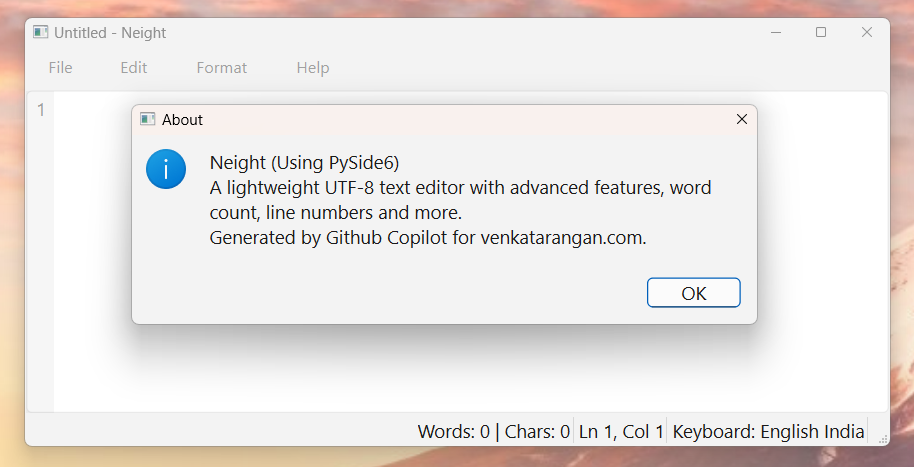

# Neight – Notepad Enhanced, AI-Built and Tamil-Friendly

**Neight** is a lightweight text editor for Windows inspired by Notepad but enhanced with a few thoughtful additions. It’s designed mainly for my personal writing workflow in Tamil and English — and as an experiment in building a complete, usable Windows app entirely through Generative AI.

---
### Option 1: Download Pre-built Executable (Recommended)

**Direct Download:**
- [Download Neight.exe](https://github.com/venkatarangan/neight/raw/main/dist/Neight.exe) (~43 MB)

**Installation Steps:**
1. Download the executable from the link above
2. Copy `Neight.exe` to a folder of your choice:
   - For personal use: `C:\Users\<YourName>\Apps\Neight\`
   - System-wide (requires admin): `C:\Program Files\Neight\`
3. **Optional**: Pin `Neight.exe` to your **Start Menu** or **Taskbar** for quick access
4. Double-click to run!

**Note:** Since there's no Windows installer yet, Windows Defender SmartScreen might show a warning on first run. Click "More info" → "Run anyway" to proceed.

---
## Why I built Neight

Around **Early 2025**, I ran into a problem.
In **Windows 11**, with the new **Tamil (India) - Tamil Anjal keyboard layout**, the built-in Notepad.exe started showing rendering issues with Tamil Unicode text. Strangely, everywhere else — browsers, Word, system UI — worked fine. Only Notepad struggled.

The new Notepad (with Copilot integration) probably uses a different text control from the earlier version that had tab support, and something about that broke Tamil input.

I tried alternatives:

* **Sublime Text** works, but it’s paid and overkill for quick Tamil typing.
* **Notepad++** is powerful but too cluttered.
* **Visual Studio Code** is great but not for a few quick paragraphs in Tamil and English.

For my use case — daily Tamil social media posts and weekly magazine columns — I needed something simple, fast and predictable.

**iA Writer** came close, but even that failed with Tamil word selection shortcuts.

So I decided to scratch the itch myself. Using **GPT-5**, **GitHub Copilot**, and **Claude Sonnet 4.5 (Preview)**, I generated a new notepad-like app from scratch — **Neight**.

The twist: I didn’t type code manually except for minor display texts. Everything was AI-generated, refined, and assembled through prompts inside VS Code. I continue to maintain it the same way, as an ongoing experiment in AI-assisted software creation.

---
## Screenshot


More screenshots are in the screenshots folder

## Features

Neight keeps all the essentials of Notepad and adds a few thoughtful touches.

### Familiar Notepad features

* File menu with **New**, **Open**, **Save**, **Save As**, and **Exit**
* Editing options like **Undo**, **Redo**, **Cut**, **Copy**, **Paste**, **Find/Replace**, **Go To**, **Time/Date**
* Word wrap toggle, custom fonts, and status bar
* Most keyboard shortcuts (Ctrl+S, Ctrl+F, F5, etc.) work as expected
* Supports Dark Mode

### Enhancements

* **Line numbers** and **column tracking**
* **Word and character count** (handy for magazine and blog writing)
* **Auto-save** every 5 minutes (default, configurable)
* **Remembers**:

  * Last opened file
  * Window size
  * Font name and size
* **Quick Google Search**: Select text and press **Ctrl+E** or right-click → “Search with Google”
* **Language toggle shortcut**:

  * Press **Ctrl key twice quickly** to toggle between Tamil Anjal and English (India)
  * Or use **Ctrl+,** for English (India) and **Ctrl+.** for Tamil Anjal
  * Current keyboard layout is shown in the status bar bottom right

---
## Clone the Repository

If you want the full source code:

```bash
git clone https://github.com/venkatarangan/neight.git
cd neight
```

Then grab `dist\Neight.exe` from the downloaded folder.

### Settings File Location

When you run Neight, it automatically creates a `settings.json` file:
- **If installed in a writable folder**: Settings are saved in the same folder as the executable
- **If installed in Program Files**: Settings are saved to `%LOCALAPPDATA%\Neight\settings.json`

The app automatically detects write permissions and chooses the appropriate location.

---

## Building Neight from Source

**Requirements**

* **Python 3.10+**
* **PySide6** (install using pip)

```
python -m pip install --upgrade pip
python -m pip install PySide6
```

**To build the executable:**

```
python -m pip install pyinstaller
pyinstaller --onefile neight.py
```

After the build completes, your compiled file will be in the **dist** folder.

---

## Running Neight

* Tested on **Windows 11 (25H2)**
* Requires Tamil (India) – Tamil Anjal and English (India) keyboard layouts installed

Run the app once and it will create a **settings.json** file next to the executable.
It stores your preferences (font, window size, last opened file, autosave interval, etc.).

---

## How it works (briefly)

Neight uses **PySide6**, the official Qt6 Python binding, to handle:

* The text editor (`QPlainTextEdit`)
* Menus, dialogs, and status bar
* Persistent settings stored in JSON
* A small **ctypes** module for Windows API calls to switch keyboard layouts programmatically

All preferences are remembered automatically, including fonts, window size, and autosave intervals.

It’s a single Python file — self-contained and clean — yet offers everything you expect from a modern, minimal text editor.

---

## Keyboard Shortcuts (Summary)

| Action                        | Shortcut                       |
| ----------------------------- | ------------------------------ |
| New File                      | Ctrl+N                         |
| Open                          | Ctrl+O                         |
| Save                          | Ctrl+S                         |
| Save As                       | Ctrl+Shift+S                   |
| Exit                          | Alt+F4                         |
| Undo / Redo                   | Ctrl+Z / Ctrl+Y                |
| Cut / Copy / Paste            | Ctrl+X / Ctrl+C / Ctrl+V       |
| Find / Replace                | Ctrl+F / Ctrl+H                |
| Go To Line                    | Ctrl+G                         |
| Insert Date/Time              | F5                             |
| Word Wrap                     | Alt+O, W                       |
| Font                          | Alt+O, F                       |
| Search Google                 | Ctrl+E                         |
| Switch Layout (English↔Tamil) | Double Ctrl or Ctrl+, / Ctrl+. |
| Zoom In / Out                 | Ctrl+Plus / Ctrl+Minus         |

---

## Configuration and File Structure

When you run Neight, it automatically creates:

```
settings.json
```

**Location:**
* **Development/Portable:** Same directory as the executable (if writable)
* **Program Files Install:** `%LOCALAPPDATA%\Neight\settings.json`
  - Typical path: `C:\Users\<YourName>\AppData\Local\Neight\settings.json`

The app automatically detects write permissions and uses the appropriate location.
If you move the app from a writable location to Program Files, settings are automatically migrated to AppData.

This file remembers:

* Last opened file
* Font family and size
* Word wrap setting
* Window size
* Auto-save interval
* Last used directory

---

## The Name

The name **Neight** came from **NotepadEnhanced → NotepadE  → N8 → Neight**.
It’s short, memorable, and unique.

The icon was AI-generated from a Python script written by GPT-5.
The green tones were chosen to match the colour scheme from my blog [venkatarangan.com](https://venkatarangan.com).

---

## Future Ideas

* Basic **Markdown** support
* Export to **DOCX** and **PDF**
* A proper **Windows Installer**
* Optional **AI features** for translation, rewriting, or lookup
* Integrate Tamil dictionary (like Tamil Nadu Government’s Sorkuvai)

---

## License

This project is licensed under the **MIT License**.
See the LICENSE file for details.

---

## Acknowledgement of AI

This project was entirely built using **AI tools**:
**GPT-5 (ChatGPT)**, **GitHub Copilot**, and **Claude Sonnet 4.5 (Preview)**, with **GPT-5 Codex (Preview)** for improvements.
I didn’t manually write the code, except for text and configuration tweaks.
It’s a working demonstration of what’s now possible with AI-driven coding.

---

## Disclaimer

This is a personal, experimental project built for learning and daily use.
It’s not intended for commercial purposes.
All third-party trademarks and copyrights belong to their respective owners.
Use at your own discretion — no guarantees or warranties are provided.

